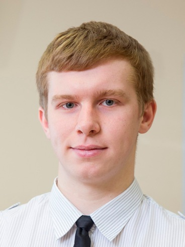

My name is **Vasiliev Evgeny**.

I'm teacher assistant and PhD student in Lobachevsky State University.

# About me

Age: 25

City: Nizhny Novgorod, Russia

Languages: Russian (native), English (intermediate)

E-mail: eugene.unn@gmail.com

# Education

2010-2014
Bachelor's degree in Lobachevsky State University

2014-2016
Master's degree in Lobachevsky State University 

2016-current time
PhD student in Lobachevsky State University

2017
Exchange student in Saitama University

# Area of research

* Scientific visualization
* Medical segmentation
* Computational Geometry
* Geometric Modelling

# SKILLS

* Software Development
* Coding & Scripting
* Crossplatform programming
* GUI Design
* Debuging and Troubleshooting
* Agile

# Technology Summary

*   **Programming/Languages**: С, C++, C#, OpenGL, GLSL
*   **Programming/Technologies**: CMake, Git, Svn 
*   **Programming/Frameworks**: Qt, VTK, ITK, CGAL, OpenTK
*   **Systems**: Windows, Linux

* * *

# Links
* **GitHub**: [Here](https://github.com/FenixFly/)
* **Telegram**: [Here](https://t.me/vasiliev_e)
* **Facebook**: [Here](https://www.facebook.com/vasilev.e.russia)
* **VK**: [Here](https://vk.com/eugene_v)
* **Instagram**: [Here](https://www.instagram.com/eugene.unn)
* **ResearchGate**: [Here](https://www.researchgate.net/profile/Evgeniy_Vasilyev)